# 🦟 VigiSaúde Brasil — Dashboard de Vigilância Epidemiológica

<div align="center">

**Dashboard interativo para monitoramento de doenças infecciosas no Brasil, com correlação de dados de saneamento (esgoto).**

Inspirado no [WastewaterSCAN](https://data.wastewaterscan.org/) (EUA), adaptado para o contexto brasileiro usando **APIs de dados públicos**.

[](https://developer.mozilla.org/en-US/docs/Web/JavaScript)
[](https://vitejs.dev/)
[](https://leafletjs.com/)
[](https://www.chartjs.org/)

</div>

---

## 📋 Sobre o Projeto

O **VigiSaúde Brasil** é um dashboard de vigilância epidemiológica que monitora **Dengue**, **Chikungunya** e **Zika** em tempo real, correlacionando os dados de doenças com indicadores de **saneamento básico (esgoto)** por estado.

O objetivo é visualizar a relação entre a cobertura de coleta e tratamento de esgoto e a incidência de doenças transmitidas por mosquitos no Brasil.

### 🎯 Funcionalidades

- 🗺️ **Mapa Interativo** — Mapa do Brasil colorido por nível de alerta epidemiológico, com dados de saneamento nos popups
- 📈 **Rastreador de Doenças** — Gráficos de séries temporais para qualquer município brasileiro
- 🦟 **3 Patógenos** — Dengue, Chikungunya e Zika (via InfoDengue)
- 🚰 **Dados de Esgoto** — Cobertura de coleta e tratamento de esgoto por estado (SNIS)
- 📊 **Correlação Esgoto × Doenças** — Gráfico de dispersão mostrando a relação entre saneamento e incidência
- 📉 **Taxa Rt** — Monitoramento da taxa de reprodução com linha de referência Rt=1
- 🌡️ **Dados Climáticos** — Temperatura e umidade associados à transmissão
- 🔍 **Busca de Municípios** — Pesquisa entre 5.570+ municípios do IBGE
- 🌙 **Dark Mode** — Interface premium com glassmorphism

---

## 🔗 APIs Públicas Utilizadas

| API | Descrição | Endpoint |
|-----|-----------|----------|
| **[InfoDengue](https://info.dengue.mat.br/)** | Alertas de Dengue, Chikungunya e Zika por semana epidemiológica | `info.dengue.mat.br/api/alertcity` |
| **[IBGE Localidades](https://servicodados.ibge.gov.br/api/docs/localidades)** | Estados e municípios do Brasil | `servicodados.ibge.gov.br/api/v1/localidades` |
| **[IBGE Malhas](https://servicodados.ibge.gov.br/api/docs/malhas)** | GeoJSON do mapa do Brasil por UF | `servicodados.ibge.gov.br/api/v3/malhas` |
| **[SNIS/SINISA](https://www.gov.br/cidades/pt-br/assuntos/saneamento/snis)** | Cobertura de esgoto por estado | Dados compilados (referência 2023) |

> Todas as APIs são **públicas e gratuitas**, sem necessidade de autenticação.

---

## 🏗️ Arquitetura

```
vigisaude-brasil/
├── index.html              # Estrutura HTML (3 views: Mapa, Rastreador, Info)
├── vite.config.js          # Configuração do Vite
├── package.json
├── .gitignore
└── src/
    ├── main.js             # Entry point — orquestra componentes
    ├── services/
    │   └── api.js          # Serviço de dados (InfoDengue, IBGE, SNIS)
    ├── components/
    │   ├── map.js          # Mapa Leaflet com GeoJSON e popups
    │   ├── charts.js       # Gráficos Chart.js (casos, Rt, incidência, clima, esgoto)
    │   ├── cards.js        # Cards de doenças na sidebar
    │   └── filters.js      # Filtros, seletores, busca
    └── styles/
        └── index.css       # Design system completo (dark mode, glassmorphism)
```

### Fluxo de Dados

```mermaid
graph LR
    A[InfoDengue API] -->|Casos, Rt, Incidência| D[Dashboard]
    B[IBGE APIs] -->|Estados, Municípios, GeoJSON| D
    C[SNIS Data] -->|Coleta/Tratamento Esgoto| D
    D --> E[Mapa Interativo]
    D --> F[Gráficos Temporais]
    D --> G[Correlação Esgoto×Doenças]
```



---

## 🚀 Como Executar

### Pré-requisitos

- [Node.js](https://nodejs.org/) v18+
- npm

### Instalação

```bash
# Clone o repositório
git clone https://github.com/madsondeluna/esgoto-app.git
cd esgoto-app

# Instale as dependências
npm install

# Inicie o servidor de desenvolvimento
npm run dev
```

O dashboard estará disponível em **http://localhost:3000**.

---

## 📊 Dados de Saneamento

Os dados de saneamento são do **SNIS (Sistema Nacional de Informações sobre Saneamento)**, referência 2022/2023. Incluem:

- **% Coleta de Esgoto** — Parcela da população com coleta de esgoto sanitário
- **% Tratamento de Esgoto** — Parcela do esgoto coletado que recebe tratamento

A correlação com dados epidemiológicos permite analisar como a infraestrutura de saneamento influencia a incidência de arboviroses no Brasil.

---

## 🛠️ Tecnologias

- **[Vite](https://vitejs.dev/)** — Build tool e dev server
- **[Leaflet](https://leafletjs.com/)** — Mapas interativos
- **[Chart.js](https://www.chartjs.org/)** — Gráficos e visualizações
- **Vanilla JS (ES Modules)** — Sem frameworks, código limpo e modular
- **CSS Custom Properties** — Design system com tokens de cores
- **Google Fonts** — Inter (UI) + JetBrains Mono (dados)

---

## 📄 Licença

Este projeto é open source e utiliza dados públicos abertos do governo brasileiro.

---

<div align="center">

Desenvolvido com ☕ e dados abertos 🇧🇷

**[InfoDengue](https://info.dengue.mat.br/) · [IBGE](https://servicodados.ibge.gov.br/) · [SNIS](https://www.gov.br/cidades/pt-br/assuntos/saneamento/snis)**

</div>
